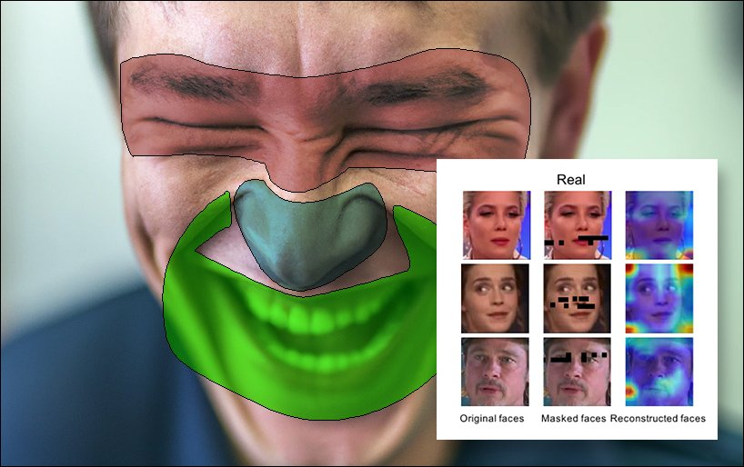

Techniques Détaillées pour Détecter les Deepfakes

  

Avec l'essor des deepfakes, il devient essentiel de maîtriser des techniques avancées pour repérer ces manipulations numériques. Les deepfakes utilisent des algorithmes d'intelligence artificielle pour créer des contenus difficilement distinguables du réel. Voici un guide approfondi pour détecter et contrer ces faux contenus.

---

## 1. Analyse des Traits Faciaux

### Description
L’analyse des traits faciaux détecte les incohérences dans les expressions et les mouvements du visage générés par les deepfakes.

### Points Clés
- **Landmarks faciaux** : Analyse des yeux, du nez, de la bouche et des sourcils pour repérer des anomalies.
- **Mouvements** : Les expressions naturelles suivent des schémas difficiles à imiter par l’IA.
- **Artéfacts visuels** : Bordures floues, textures de peau incohérentes, et éclairages mal ajustés.

### Avantages
- Précision accrue grâce à l’apprentissage automatique.
- Capacité à identifier les imperfections subtiles.

---

## 2. Analyse Forensique

### Description
La méthode forensique examine les fichiers numériques pour trouver des indices de manipulation.

### Techniques Utilisées
- **Artéfacts numériques** : Compression vidéo, bruit, et motifs incohérents.
- **Métadonnées** : Vérification des dates, des appareils utilisés et des signatures numériques.
- **Alignement et ombres** : Détection des incohérences dans les ombres ou les réflexions.

### Applications
- Examen des contenus vidéo suspects.
- Analyse des voix pour identifier des manipulations audio.

---

## 3. Analyse de Synchronisation Labiale

### Description
La synchronisation entre les mouvements des lèvres et l’audio peut révéler des deepfakes.

### Méthodes
- **Suivi des lèvres** : Analyse de leur position et de leur forme pour détecter des décalages.
- **Cohérence audio/visuelle** : Comparaison entre les mots prononcés et les mouvements correspondants.
- **Expressions associées** : Vérification des expressions faciales lors du discours.

### Importance
- Identifier les manipulations dans les discours publics ou les vidéos compromettantes.
- Détection renforcée grâce aux algorithmes de vision par ordinateur.

---

## 4. Analyse des Métadonnées

### Description
Les métadonnées révèlent des informations cachées sur l’origine et la modification des fichiers.

### Points à Examiner
- **Timestamps** : Anomalies dans les dates et heures d’enregistrement.
- **Informations sur l'appareil** : Cohérence avec le type de caméra ou de logiciel utilisé.
- **Signature numérique** : Vérification de l'intégrité du fichier.

### Limites
- Nécessite une expertise technique pour l’analyse approfondie.
- Les deepfakes avancés peuvent falsifier certaines métadonnées.

---

## 5. Utilisation du Machine Learning

### Description
Les modèles d’apprentissage automatique permettent de détecter les deepfakes grâce à l’analyse de larges ensembles de données.

### Techniques
- **CNN (Convolutional Neural Networks)** : Identifier les motifs visuels et les artefacts spécifiques.
- **RNN (Recurrent Neural Networks)** : Analyser les séquences vidéo pour détecter des incohérences temporelles.
- **GANs (Generative Adversarial Networks)** : Utiliser la compétition entre générateurs et discriminateurs pour perfectionner la détection.

### Avantages
- Haut niveau d’automatisation et d’efficacité.
- Amélioration continue grâce à des ensembles de données en constante évolution.

---

## 6. Sensibilisation et Éducation

### Objectifs
Renforcer la vigilance face aux deepfakes en sensibilisant le public et en développant des compétences d’analyse critique.

### Actions Recommandées
- **Formation** : Organiser des ateliers sur la reconnaissance des contenus falsifiés.
- **Diffusion de guides pratiques** : Fournir des ressources éducatives pour les particuliers et les professionnels.
- **Tests de sensibilisation** : Proposer des exercices interactifs pour apprendre à repérer les anomalies.

---

## Conclusion

La détection des deepfakes est un défi technique et sociétal majeur. En combinant des techniques avancées comme l’analyse faciale, forensique et labiale, avec des outils basés sur le machine learning et une sensibilisation accrue, il est possible de minimiser leur impact. Adopter une approche proactive est essentiel pour protéger l’intégrité des contenus numériques dans un monde de plus en plus connecté.
