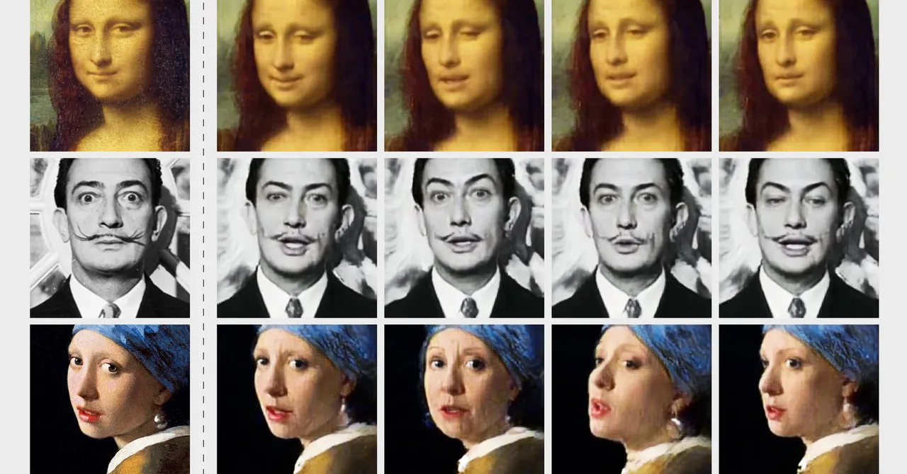

# Décrypter le Processus de Création des Deepfakes : Guide Étape par Étape


<div align="center">  </div>

## Étapes de Création des Vidéos Deepfakes

Le processus peut être divisé en **quatre grandes étapes** :  
1. Collecte et préparation des données.  
2. Alignement des visages et détection des points de repère.  
3. Extraction et représentation des caractéristiques.  
4. Échange et fusion des visages.  

Nous détaillerons chacune de ces étapes avec une explication complète des technologies utilisées.

---

### Étape 1 : Collecte et Préparation des Données

#### Sourcing des Données d'Entraînement de Haute Qualité
Pour générer des deepfakes de haute qualité, des ensembles de données contenant des milliers d'images ou vidéos sont nécessaires. Ces ensembles sont souvent collectés de diverses sources :  
- **Vidéo haute résolution** : Essentielle pour capter les micro-expressions et détails.  
- **Bases de données publiques** : Exemples incluent CelebA et LFW (Labeled Faces in the Wild)(https://www.kaggle.com/datasets/jessicali9530/lfw-dataset), qui contiennent des millions d'images annotées de visages.  
- **Données personnalisées** : Capturées par caméra ou extraites de réseaux sociaux, mais cela peut poser des questions éthiques.

#### Outils et Techniques d'Augmentation de Données
Pour maximiser la diversité des données :  
1. **Augmentation des données avec des GANs** : Les GANs (Generative Adversarial Networks) peuvent générer des images réalistes d'individus dans des poses ou conditions d'éclairage variées.  
2. **Transformations géométriques** : Redimensionner, faire pivoter, ou modifier l'éclairage pour augmenter la diversité.  
3. **Synthèse de visages manquants** : Utilisation de modèles comme StyleGAN pour générer des échantillons manquants.  

---

### Étape 2 : Alignement des Visages et Détection des Points de Repère

#### Détection des Points de Repère
La détection précise des traits du visage est cruciale pour aligner et échanger les visages.  
**Technologies clés utilisées** :  
1. **Haar Cascades** (OpenCV) : Algorithme basé sur des fonctions calculées à partir de fenêtres glissantes. Idéal pour la détection rapide des visages.  
2. **Réseaux Neuronaux Convolutifs (CNN)** : Exemples incluent MTCNN (Multi-Task Cascaded Neural Networks) et FaceNet. Ces modèles détectent non seulement les visages, mais aussi les points de repère précis.  
3. **Dlib** : Une bibliothèque populaire qui utilise des descentes de gradient pour localiser jusqu'à 68 points de repère sur le visage.

#### Alignement des Visages pour un Échange Fluide
Pour garantir que les visages sources et cibles sont alignés avec précision :  
1. **Transformation Affine** : Réalise un mappage linéaire entre deux ensembles de points pour redimensionner, faire pivoter ou déplacer les visages.  
2. **Homographie** : Utilisée pour transformer un visage selon des angles et perspectives complexes.  
3. **Spline à Plaques Minces (TPS)** : Gère les transformations non linéaires pour ajuster des détails fins comme les joues ou les rides.  

---

### Étape 3 : Extraction et Représentation des Caractéristiques

#### Extraction des Caractéristiques
Les caractéristiques du visage doivent être extraites de manière efficace afin de représenter fidèlement les traits faciaux.  
**Approches courantes** :  
1. **PCA (Analyse en Composantes Principales)** : Réduction des dimensions des données tout en conservant les principales variations du visage.  
2. **Histogramme des Gradients Orientés (HOG)** : Utilisé pour détecter les contours du visage, capturant des traits comme les yeux ou le nez.  
3. **Modèles Profonds Préentraînés** : DeepFace, ArcFace, ou VGGFace qui exploitent les couches denses pour une extraction précise.  

#### Création des Représentations Latentes
Les caractéristiques extraites sont transformées en **représentations latentes** (vecteurs dans un espace de caractéristiques).  
**Technologies impliquées** :  
1. **Autoencodeurs** : Encodeurs pour compresser les données et décodeurs pour les reconstruire.  
2. **Autoencodeurs Variationnels (VAE)** : Introduisent des variations aléatoires, essentielles pour un réalisme accru.  
3. **GANs (Generative Adversarial Networks)** : L'encodeur génère une représentation, et le générateur de GAN affine l'image pour obtenir un réalisme maximal.  

---

### Étape 4 : Échange et Fusion des Visages

#### Architectures Encodeur-Décodeur
L'encodeur extrait des caractéristiques spécifiques au visage source tandis que le décodeur génère une image à partir de ces caractéristiques dans le style du visage cible.  
**Techniques importantes** :  
1. **Pix2Pix** : Pour un échange basé sur les pixels.  
2. **CycleGAN** : Utilisé pour des échanges non supervisés entre deux styles d'images.  
3. **StyleGAN** : Génère des détails réalistes comme la texture de la peau, les rides et les cheveux.

#### Optimisation des Modèles
Pour améliorer la qualité des visages générés :  
1. **Descente de Gradient Stochastique (SGD)** : Pour ajuster les poids des réseaux neuronaux.  
2. **Optimiseur Adam** : Prisé pour sa stabilité dans les mises à jour des poids.  

#### Techniques Avancées pour un Réalisme Accru
1. **Post-Traitement des Résultats** :  
   - Ajustement des couleurs pour correspondre au ton de peau.  
   - Techniques de flou pour lisser les transitions entre le visage source et le corps cible.  
2. **Formation Progressive des GANs** : Améliore progressivement la résolution des images pour un rendu haute définition.  

---


### **Démonstration : Création d'une Vidéo Deepfake avec "Easy-Wav2Lip"**

L'objectif est de comprendre comment les algorithmes et les outils fonctionnent en coulisses en générant un exemple simple de vidéo où les mouvements des lèvres du visage s'accordent parfaitement avec un fichier audio donné.

#### **Étape 1 : Configuration de l'Environnement Colab**
Pour simplifier la création de deepfakes, nous avons conçu une interface simple via un Google Colab.  
Suivez ces étapes pour l'utiliser :  
1. Ouvrez notre démonstration interactive dans Google Colab : **[Easy-Wav2Lip Colab](https://github.com/anothermartz/Easy-Wav2Lip)**  
2. Lancez l'exécution des cellules pour configurer les outils nécessaires.  

Voici un extrait du code que vous exécuterez :  

```python
# Vérifier l'installation et configurer l'environnement
if os.path.exists('installed.txt'):
    with open('last_file.txt', 'r') as file:
        last_file = file.readline()
    if last_file == version:
        sys.exit('Easy-Wav2Lip '+version+' a déjà été exécuté dans cet environnement !')

# Vérifier la disponibilité du GPU
if not torch.cuda.is_available():
    sys.exit('Aucun GPU détecté. Veuillez activer le GPU dans les paramètres d’exécution.')

# Installer les bibliothèques nécessaires
!pip install batch_face --quiet
!pip install basicsr==1.4.2 --quiet
!pip install gfpgan --quiet
```
### Pourquoi est-ce important ?  
Cette étape montre comment les outils automatisent l'alignement, l'extraction des caractéristiques, et l'application de transformations sur les visages.

---

### Étape 2 : Ajout des Fichiers Sources  
Pour cette étape, vous devez fournir :  
- **Une vidéo source** : Le fichier contenant le visage à animer.  
- **Un fichier audio** : Optionnel, si la vidéo source n'a pas déjà de son intégré.  

#### Dans l'interface Colab :  
- **Pour les utilisateurs sur ordinateur** : Cliquez sur l'icône 📁 pour copier le chemin du fichier source.  
- **Pour les utilisateurs mobiles** : Long-press (appui long) sur un fichier pour copier son chemin.  

**Exemple de paramétrage dans Colab :**  
```python
video_file = "/content/drive/MyDrive/video.mp4"  # Remplacez avec votre chemin
vocal_file = "/content/drive/MyDrive/audio.mp3"  # Facultatif
quality = "Enhanced"  # Choisissez entre Fast, Improved ou Enhanced
```
### Étape 3 : Génération de la Vidéo Synchronisée  
Une fois les fichiers fournis, exécutez la cellule finale. Le processus inclut :  
1. **Détection et alignement du visage.**  
2. **Synchronisation labiale** basée sur le fichier audio.  
3. **Amélioration des visages** avec **GFPGAN** pour un réalisme accru.  

**Code Colab principal :**  
```python
# Synchroniser le visage avec l'audio
!python run.py --video $video_file --audio $vocal_file --quality $quality
```
Le résultat est une vidéo générée avec des lèvres parfaitement synchronisées.\

## Résultat Final : Deepfake Réalisé  

Pour notre démonstration, nous avons suivi les étapes décrites précédemment afin de construire notre propre deepfake. Et voilà le résultat que nous avons obtenu 😁 :  

### **Vidéo : Trump Deepfake**  

<video controls width="640" height="360">
  <source src="../components/trump_deepfake.mp4" type="video/mp4">
  Votre navigateur ne supporte pas la balise vidéo. Vous pouvez [télécharger la vidéo ici](../components/trump_deepfake.mp4).
</video>


---

## Considérations Éthiques

### Questions de Consentement et de Vie Privée
Les défis incluent :  
- Utilisation de visages sans consentement.  
- Risques de vol d’identité et d’atteinte à la réputation.  

**Solutions possibles** :  
- Obtenir un consentement éclairé.  
- Anonymiser ou chiffrer les données sources.  

### Utilisation Responsable de la Technologie Deepfake
Des usages malveillants incluent la désinformation, la propagande, ou la violation de la vie privée.  

**Bonnes pratiques** :  
- Respecter des lignes directrices éthiques.  
- Adopter des lois régulant les deepfakes.

---

## Conclusion

La création de deepfakes repose sur des techniques avancées d'IA et des algorithmes sophistiqués. Bien que cette technologie puisse être utilisée à des fins légitimes, elle soulève des **défis éthiques et sociaux majeurs**.  

Il est essentiel de promouvoir une utilisation responsable et de sensibiliser le public aux dangers potentiels des deepfakes.

---
