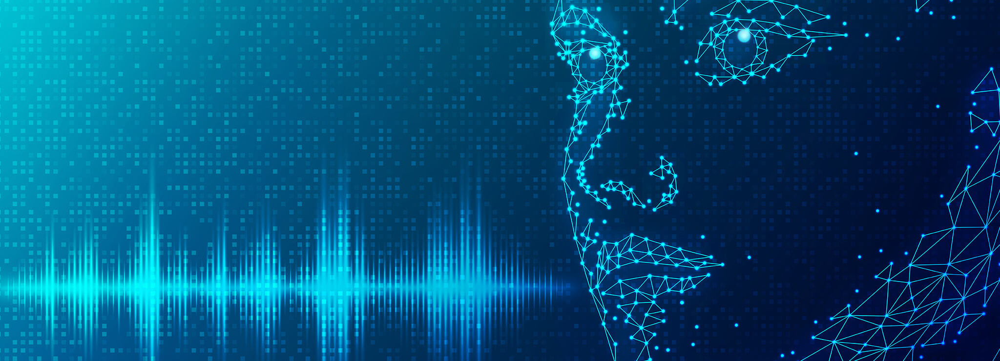

# Applications et Impact des Deepfakes

  

## Objectif
Les deepfakes sont des technologies à double tranchant. Ils possèdent des applications fascinantes et bénéfiques dans divers domaines, mais ils présentent également des risques importants. Cette section explore ces deux facettes pour aider à comprendre leur portée et leur impact sur la société.

---

## Applications Positives des Deepfakes

### 1. Effets Spéciaux dans le Cinéma
Les deepfakes révolutionnent l’industrie cinématographique en permettant de créer des effets spéciaux d’une grande précision, souvent à moindre coût :
- **Rajeunissement d’acteurs** : Par exemple, dans le film *The Irishman* (2019), la technologie a été utilisée pour rajeunir les visages des acteurs principaux, offrant une immersion totale au spectateur.
- **Résurrection numérique** : Les deepfakes permettent de recréer des performances d’acteurs décédés, comme dans *Rogue One: A Star Wars Story* (2016), où l’acteur Peter Cushing a été recréé numériquement.
- **Synchronisation labiale** : Les deepfakes facilitent la traduction des dialogues dans différentes langues en adaptant le mouvement des lèvres de l’acteur au texte traduit, rendant les doublages plus naturels.

### 2. Publicité et Marketing
Dans la publicité, les deepfakes offrent une nouvelle dimension à la création de contenu :
- **Personnalisation des campagnes** : Les marques peuvent adapter les publicités à chaque spectateur en changeant les visages ou les voix des protagonistes en fonction de leur culture ou de leur région.
- **Interaction avec des figures célèbres** : Les deepfakes permettent de créer des publicités où des célébrités interagissent directement avec le public, même sans leur implication physique.

### 3. Éducation et Sensibilisation
Les deepfakes peuvent être utilisés à des fins éducatives pour recréer des événements historiques ou simuler des expériences :
- **Reconstitutions historiques** : Faire "parler" des figures historiques comme Albert Einstein ou Martin Luther King pour expliquer des concepts scientifiques ou sociaux.
- **Simulations médicales** : Formation des professionnels de santé en recréant des situations cliniques réalistes pour améliorer les diagnostics et les traitements.

### Exemple Positif : Vidéo d’une campagne de publicité personnalisée utilisant un deepfake pour adapter le message à différentes cultures.

---

## Dangers et Abus Potentiels des Deepfakes

### 1. Diffusion de Fausses Informations
Les deepfakes représentent une menace pour la véracité de l’information :
- **Manipulation politique** : Des vidéos truquées de personnalités politiques peuvent être utilisées pour diffuser de fausses déclarations ou influencer les élections. Par exemple, une vidéo deepfake de Barack Obama avait été créée pour démontrer la facilité avec laquelle ces technologies peuvent être utilisées.
- **Fake news** : Ces vidéos rendent la tâche plus difficile aux journalistes et au public pour discerner les faits des fabrications.

### 2. Usurpation d’Identité
Les deepfakes facilitent les arnaques et les atteintes à la réputation :
- **Escroqueries** : Des vidéos peuvent être créées pour usurper l’identité d’un employé ou d’un dirigeant d’entreprise dans le but de voler des informations sensibles ou de l’argent.
- **Atteinte à la vie privée** : Des deepfakes pornographiques non consensuels sont utilisés pour nuire à des individus, une pratique qui constitue une grave violation des droits personnels.

### 3. Cybercriminalité
Les deepfakes renforcent les outils des cybercriminels :
- **Hameçonnage visuel** : Les arnaqueurs peuvent se faire passer pour des proches ou des collègues lors d’appels vidéo.
- **Fraudes financières** : En 2019, une entreprise britannique a perdu 243 000 dollars après qu’un deepfake vocal a été utilisé pour imiter la voix de son PDG, ordonnant un virement bancaire frauduleux.

### 4. Déstabilisation Sociale
- **Erosion de la confiance** : À mesure que les deepfakes deviennent plus réalistes, les spectateurs risquent de douter de l'authenticité de toutes les vidéos, y compris les vraies.
- **Manipulation psychologique** : La création de contenus diffamatoires ou traumatisants à l’aide de deepfakes peut entraîner des dommages émotionnels graves.

### Exemple Négatif : Vidéo d’un deepfake manipulant une déclaration d’un chef d’État pour simuler un appel à la guerre.

---

## Impact Global des Deepfakes

### 1. Effet sur la Société
Les deepfakes transforment la manière dont nous interagissons avec les médias :
- **Révolution dans les arts visuels** : Ils offrent de nouvelles possibilités créatives dans les arts et la culture.
- **Risques pour la démocratie** : Les deepfakes peuvent être exploités pour semer la confusion, éroder la confiance dans les institutions et polariser davantage les opinions.

### 2. Effet sur la Technologie
Le développement des deepfakes pousse les limites de l’intelligence artificielle, mais avec des implications éthiques et pratiques :
- **Développement de contre-mesures** : Des outils de détection des deepfakes, comme ceux développés par Facebook ou Microsoft, deviennent essentiels.
- **Enjeux environnementaux** : Les ressources nécessaires pour créer ces contenus soulèvent des préoccupations en matière d’empreinte carbone.

---

## Conclusion
Les deepfakes sont une technologie puissante avec un potentiel énorme, mais leurs abus présentent des dangers sérieux pour la société. Il est impératif de promouvoir une utilisation responsable tout en développant des outils pour détecter et contrer les usages malveillants. Comprendre cette dualité est essentiel pour tirer parti des avantages tout en minimisant les risques.
