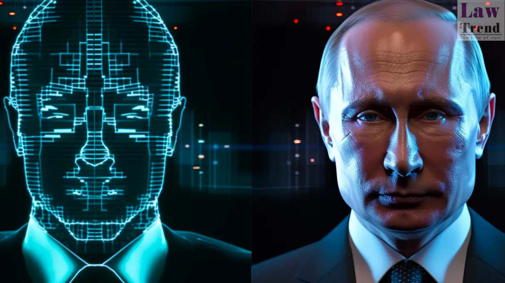

# Deepfakes - Comprendre le Phénomène

## À Propos  
Bienvenue sur **Deepfake Blog**, votre source d'information pour comprendre les technologies émergentes et leurs impacts sur la société.  
Nous explorons ici les **deepfakes**, des créations fascinantes mais controversées issues de l'intelligence artificielle.  

---

## Illustration de Deepfake  
  

---

## Introduction  

Imaginez une vidéo montrant une célébrité ou un politicien prononçant des paroles incendiaires, qui deviennent virales en quelques minutes. Peu après, il est révélé que ces images sont fausses : la vidéo a été manipulée avec une précision troublante.  
Ce phénomène, connu sous le nom de **deepfake**, s’appuie sur l’intelligence artificielle pour générer des contenus vidéo, audio ou visuels trompeurs.  

Les **deepfakes** combinent des technologies avancées d’apprentissage profond (deep learning) et de manipulation numérique pour imiter des visages, des voix, ou même des mouvements de manière extrêmement réaliste. Si ces créations peuvent émerveiller par leur ingéniosité, elles soulèvent également de graves préoccupations éthiques et sociétales.  

Dans cet article, nous explorerons :  
- Ce que sont les deepfakes et comment ils fonctionnent.  
- Pourquoi ils représentent un danger pour les individus et les sociétés.  
- Les différents types de deepfakes et leurs implications.  

---

## Qu'est-ce qu'un Deepfake ?  

Le terme **deepfake** provient de la contraction de "deep learning" (apprentissage profond) et "fake" (faux).  
Un deepfake est une **vidéo, une image ou un fichier audio créé à l’aide de modèles d’intelligence artificielle** pour imiter l'apparence, la voix ou les gestes d’une personne réelle. Ces contenus sont souvent si réalistes qu’ils peuvent facilement tromper les spectateurs et les auditeurs.  

La création de deepfakes repose principalement sur des technologies comme :  
- **Réseaux Antagonistes Génératifs (GANs)** : Un modèle d’IA où deux algorithmes (le générateur et le discriminateur) s’affrontent pour produire des images ou des sons de plus en plus réalistes.  
- **Autoencodeurs** : Ces réseaux neuronaux compressent les caractéristiques essentielles d’un visage ou d’une voix pour les reproduire fidèlement dans un autre contexte.  

Les deepfakes sont un exemple frappant des capacités de l’intelligence artificielle, illustrant à quel point les machines peuvent apprendre et imiter la complexité humaine.  

---

## Types de Deepfakes  

Les deepfakes se déclinent en plusieurs types, chacun avec des usages, des bénéfices, et des risques spécifiques.  

### 1. **Lip-Sync Deepfakes**  
Les lip-sync deepfakes modifient les mouvements des lèvres d’une personne dans une vidéo pour les faire correspondre à un nouvel enregistrement audio.  

#### Fonctionnement :  
- Les **algorithmes d’IA**, comme les réseaux antagonistes génératifs (GANs), apprennent à imiter les mouvements des lèvres à partir de nombreuses vidéos et images.  
- Une fois entraîné, le système superpose des mouvements labiaux modifiés sur une vidéo existante pour synchroniser les lèvres avec un nouvel enregistrement audio.  

#### Usages Potentiels :  
- **Industrie cinématographique** : Adapter les dialogues pour des doublages de films dans différentes langues, évitant aux acteurs de rejouer des scènes.  
- **Divertissement** : Créer des vidéos humoristiques ou créatives.  

#### Risques :  
- **Désinformation** : Ces vidéos peuvent montrer des personnes influentes disant des choses qu’elles n’ont jamais dites, manipulant l’opinion publique.  
- **Atteintes à la réputation** : Elles peuvent être utilisées pour des attaques personnelles ou politiques, déformant la réalité de manière crédible.  

---

### 2. **Face Swap Deepfakes**  
Les face swap deepfakes permettent de remplacer le visage d’une personne dans une vidéo ou une image par celui d’une autre.  

#### Fonctionnement :  
- Entraînée sur des images des visages concernés, l’IA crée un "modèle" des caractéristiques faciales des deux individus.  
- L’algorithme applique ensuite les traits du visage sur le corps de l’autre personne dans un cadre vidéo ou photo.  

#### Usages Potentiels :  
- **Industrie du divertissement** : Création de scènes de films où des acteurs jouent des rôles qu’ils n’ont jamais filmés.  
- **Médias sociaux** : Vidéos humoristiques ou satiriques avec des visages célèbres.  

#### Risques :  
- **Usurpation d’identité** : Créer des vidéos compromettantes avec des visages de personnalités ou d’individus ordinaires, souvent sans leur consentement.  
- **Cybercriminalité** : Tromper des systèmes de reconnaissance faciale pour accéder à des comptes ou à des données sensibles.  
- **Diffamation** : Production de contenus inappropriés ou illégaux avec le visage d’une personne innocente.  

---

### 3. **Audio Deepfakes**  
Les audio deepfakes consistent à imiter la voix d’une personne grâce à des algorithmes d’IA formés sur des échantillons de sa voix.  

#### Fonctionnement :  
- L’IA analyse des enregistrements pour apprendre les **caractéristiques vocales** : tonalité, rythme, accentuation.  
- Une fois entraîné, le modèle peut générer de nouveaux enregistrements audio qui semblent avoir été prononcés par la personne imitée.  

#### Usages Potentiels :  
- **Accessibilité** : Création de voix synthétiques pour les personnes ayant perdu leur capacité à parler.  
- **Divertissement** : Ajout de voix personnalisées pour des personnages de films ou de jeux vidéo.  

#### Risques :  
- **Fraude et escroqueries** : Utilisation de voix synthétiques pour duper des proches ou des employés d’une entreprise.  
- **Désinformation** : Diffusion de discours fictifs attribués à des figures d’autorité.  

---

### 4. **Contextual Deepfakes**  
Les contextual deepfakes modifient non seulement le sujet principal d’une vidéo, mais aussi son environnement ou son contexte.  

#### Fonctionnement :  
- Les algorithmes d’IA utilisent des indices visuels comme les ombres, la lumière ou l’arrière-plan pour insérer ou supprimer des éléments dans une scène existante.  
- Cette technologie demande des modèles de deep learning plus avancés capables d’intégrer plusieurs couches de données visuelles.  

#### Usages Potentiels :  
- **Cinéma** : Création de scènes réalistes sans avoir besoin de lieux de tournage coûteux.  
- **Effets spéciaux** : Modification du contenu visuel pour correspondre à une vision artistique.  

#### Risques :  
- **Manipulation de la vérité** : Ces vidéos peuvent modifier des événements passés pour changer leur narration, impactant la perception publique.  
- **Détournement de preuves** : Dans un contexte juridique ou journalistique, elles peuvent fausser la réalité.  

---

## Pourquoi les Deepfakes sont-ils Dangereux ?  

Les dangers des deepfakes proviennent de leur capacité à manipuler la réalité de manière crédible.  
1. **Désinformation** : Influence des opinions publiques par des discours ou des événements falsifiés.  
2. **Atteinte à la vie privée** : Exploitation d’images ou d’enregistrements audio sans consentement.  
3. **Fraude et cybercriminalité** : Usurpation d’identité et tromperie pour des gains financiers ou politiques.  

---

## Conclusion  

Les **deepfakes** incarnent une avancée technologique impressionnante mais controversée.  
Ils permettent des innovations dans le domaine du divertissement, de l’accessibilité et de l’éducation, mais posent également des risques majeurs pour la vie privée, la sécurité et la confiance publique.  

---
